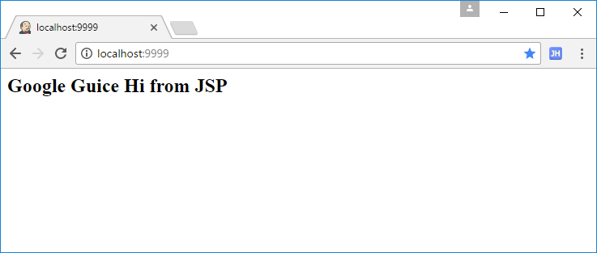
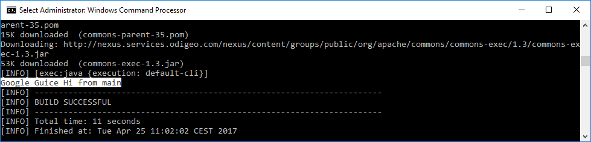

# Java EE con Google Guice

Aplicación Java Web usando Google guice


## Prerequisitos

1. Maven 3+
2. Java 8+

## Como correr

1. Clon

	```
	git clone https://github.com/humbertodias/java-google-guice-demo.git
	```

2. Entrar en la carpeta

	```
	cd java-google-guice-demo
	```

3. Correr 

	```
	mvn jetty:run -Djetty.http.port=9999
	```	

	```
	[INFO] Web defaults = org/eclipse/jetty/webapp/webdefault.xml
	[INFO] Web overrides =  none
	[INFO] web.xml file = file:///C:/dev/repository/git/demo-google-guice/src/main/webapp/WEB-INF/web.xml
	[INFO] Webapp directory = C:\dev\repository\git\demo-google-guice\src\main\webapp
	2017-04-25 10:52:52.950:INFO:oejs.Server:main: jetty-9.4.4.v20170414
	2017-04-25 10:52:53.753:INFO:oeja.AnnotationConfiguration:main: Scanning elapsed time=619ms
	2017-04-25 10:52:53.904:INFO:oejs.session:main: DefaultSessionIdManager workerName=node0
	2017-04-25 10:52:53.906:INFO:oejs.session:main: No SessionScavenger set, using defaults
	2017-04-25 10:52:53.910:INFO:oejs.session:main: Scavenging every 660000ms
	2017-04-25 10:52:54.159:INFO:oejsh.ContextHandler:main: Started o.e.j.m.p.JettyWebAppContext@4d96250{/,file:///C:/dev/repository/git/demo-google-guice/src/main/webapp/,AVAILABLE}{file:///C:/dev/repository/git/demo-google-guice/src/main/webapp/}
	2017-04-25 10:52:54.175:INFO:oejs.AbstractConnector:main: Started ServerConnector@1b75fceb{HTTP/1.1,[http/1.1]}{0.0.0.0:9999}
	2017-04-25 10:52:54.179:INFO:oejs.Server:main: Started @3896ms
	[INFO] Started Jetty Server
	```
	
4. Por último, en su navegador

	[http://localhost:9999](http://localhost:9999)

# Respuesta




en terminal

```
mvn exec:java -Dexec.mainClass="app.HelloWorldGuiceMainClass"
```




## Referencias

[JSF Home](http://www.oracle.com/technetwork/java/javaee/javaserverfaces-139869.html)